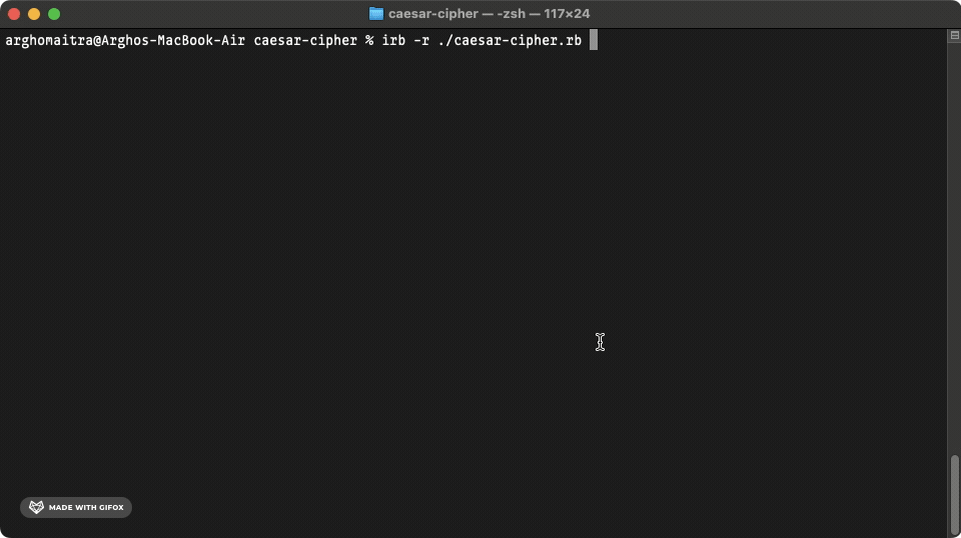

# caesar-cipher
The Most Widely Known Encryption Technique

## Demo

## General Info

**caesar-cipher** is the [first project](https://www.theodinproject.com/lessons/ruby-caesar-cipher) in the [Ruby Course](https://www.theodinproject.com/paths/full-stack-ruby-on-rails/courses/ruby) from the [Full Stack Ruby on Rails](https://www.theodinproject.com/paths/full-stack-ruby-on-rails) path in the [The Odin Project](https://www.theodinproject.com/about).

## Technologies

+ ***CLI***
+ ***Git***
+ ***GitHub***
+ ***Ruby***

## Self-reflections

> It took quite some time to reach here. I always keep the stuff I learnt about motivation and mindset in the beginning part of the odin project close to my heart. It has proved valuable in overcoming many of the challenges that I've faced as of now.

> This was an easy project. I learned a whole lot about installing Ruby and all the different basic Ruby tidbits prior to starting this project. A quick overview of the Wikipedia article on the Caesar Cipher gave me everything there is know about this project.

> I did make some extra configurations upon revisiting this project. Not all changes were made because the significance of the project is not that monumental, however, I did include several different aspects of project management, linting, and formatting as per the norms.

## Contact and Support

+ Feel free to contact ***mitrohgr_03505*** on discord for project-related queries.
+ No further feature modifications or improvements will be done to this project.
